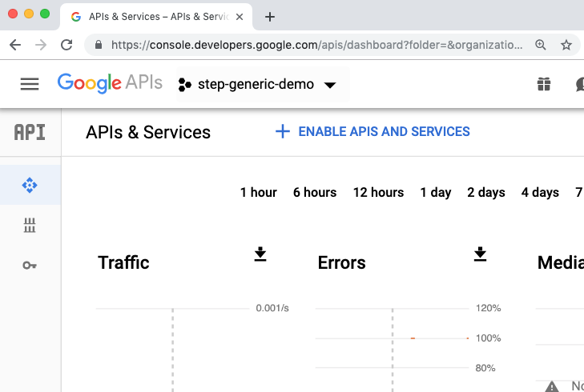
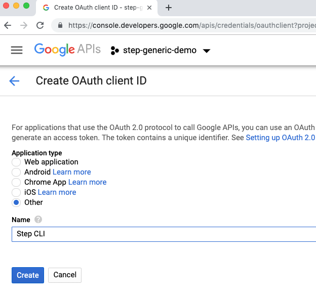

# Getting Started

Demonstrates setting up your own public key infrastructure (PKI) and certificate authority (CA) using `step ca`
and getting certificates using the `step` command line tool and SDK.

Check out [Getting started with docker](docker.md) to run [step certificates](https://github.com/smallstep/certificates)
using docker.


## Prerequisites

* [Step CA](#installation-guide)

## Terminology

### PKI - Public Key Infrastructure

A set of roles, policies, and procedures needed to create, manage, distribute,
use, store, and revoke digital certificates and manage public-key encryption.
The purpose of a PKI is to facilitate the secure electronic transfer of
information for a range of network activities.

### Provisioners

Provisioners are people or code that are registered with the CA and authorized
to issue "provisioning tokens". Provisioning tokens are single use tokens that
can be used to authenticate with the CA and get a certificate.

See [provisioners.md](provisioners.md) for more information on the supported
provisioners and its options.

## Initializing PKI and configuring the Certificate Authority

To initialize a PKI and configure the Step Certificate Authority run:

> **NOTE**: `step ca init` only initialize an x509 CA. If you
> would like to initialize an SSH CA as well, add the `--ssh` flag.

```
step ca init [--ssh]
```

You'll be asked for a name for your PKI. This name will appear in your CA
certificates. It doesn't really matter what you choose. The name of your
organization or your project will suffice.

If you run:

```
tree $(step path)
```

You should see:

```
.
├── certs
│   ├── intermediate_ca.crt
│   ├── root_ca.crt
│   ├── ssh_host_key.pub (--ssh only)
│   └── ssh_user_key.pub (--ssh only)
├── config
│   ├── ca.json
│   └── defaults.json
└── secrets
    ├── intermediate_ca_key
    ├── root_ca_key
    ├── ssh_host_key (--ssh only)
    └── ssh_user_key (--ssh only)
```

The files created include:

* `root_ca.crt` and `root_ca_key`: the root certificate and private key for
your PKI.

* `intermediate_ca.crt` and `intermediate_ca_key`: the intermediate certificate
and private key that will be used to sign leaf certificates.

* `ssh_host_key.pub` and `ssh_host_key` (`--ssh` only): the SSH host pub/priv key
pair that will be used to sign new host SSH certificates.

* `ssh_user_key.pub` and `ssh_user_key` (`--ssh` only): the SSH user pub/priv key
pair that will be used to sign new user SSH certificates.

* `ca.json`: the configuration file necessary for running the Step CA.

* `defaults.json`: file containing default parameters for the `step` CA cli
interface. You can override these values with the appropriate flags or
environment variables.

All of the files ending in `_key` are password protected using the password
you chose during PKI initialization. We advise you to change these passwords
(using the `step crypto change-pass` utility) if you plan to run your CA in a
non-development environment.

## What's Inside `ca.json`?

`ca.json` is responsible for configuring communication, authorization, and
default new certificate values for the Step CA. Below is a short list of
definitions and descriptions of available configuration attributes.

* `root`: location of the root certificate on the filesystem. The root certificate
is used to mutually authenticate all api clients of the CA.

* `crt`: location of the intermediate certificate on the filesystem. The
intermediate certificate is returned alongside each new certificate,
allowing the client to complete the certificate chain.

* `key`: location of the intermediate private key on the filesystem. The
intermediate key signs all new certificates generated by the CA.

* `password`: optionally store the password for decrypting the intermediate private
key (this should be the same password you chose during PKI initialization). If
the value is not stored in configuration then you will be prompted for it when
starting the CA.

* `address`: e.g. `127.0.0.1:8080` - address and port on which the CA will bind
and respond to requests.

* `dnsNames`: comma separated list of DNS Name(s) for the CA.

* `logger`: the default logging format for the CA is `text`. The other option
is `json`.

* `db`: data persistence layer. See [database documentation](./database.md) for more
info.

    - type: `badger`, `bbolt`, `mysql`, etc.

    - dataSource: `string` that can be interpreted differently depending on the
    type of the database. Usually a path to where the data is stored. See
    the [database configuration docs](./database.md#configuration) for more info.

    - database: name of the database. Used for backends that may have
    multiple databases. e.g. MySQL

    - valueDir: directory to store the value log in (Badger specific).

* `tls`: settings for negotiating communication with the CA; includes acceptable
ciphersuites, min/max TLS version, etc.

* `authority`: controls the request authorization and signature processes.

    - `template`: default ASN1DN values for new certificates.

    - `claims`: default validation for requested attributes in the certificate request.
    Can be overriden by similar claims objects defined by individual provisioners.

        * `minTLSCertDuration`: do not allow certificates with a duration less
        than this value.

        * `maxTLSCertDuration`: do not allow certificates with a duration greater
        than this value.

        * `defaultTLSCertDuration`: if no certificate validity period is specified,
        use this value.

        * `disableIssuedAtCheck`: disable a check verifying that provisioning
        tokens must be issued after the CA has booted. This is one prevention
        against token reuse. The default value is `false`. Do not change this
        unless you know what you are doing.

        SSH CA properties

        * `minUserSSHDuration`: do not allow certificates with a duration less
        than this value.

        * `maxUserSSHDuration`: do not allow certificates with a duration
        greater than this value.

        * `defaultUserSSHDuration`: if no certificate validity period is specified,
        use this value.

        * `minHostSSHDuration`: do not allow certificates with a duration less
        than this value.

        * `maxHostSSHDuration`: do not allow certificates with a duration
        greater than this value.

        * `defaultHostSSHDuration`: if no certificate validity period is specified,
        use this value.

        * `enableSSHCA`: enable all provisioners to generate SSH Certificates.
        The deault value is `false`. You can enable this option per provisioner
        by setting it to `true` in the provisioner claims.

    - `provisioners`: list of provisioners.
    See the [provisioners documentation](./provisioners.md). Each provisioner
    has an optional `claims` attribute that can override any attribute defined
    at the level above in the `authority.claims`.

`step ca init` will generate one provisioner. New provisioners can be added by
running `step ca provisioner add`.

## Running the CA

To start the CA run:

```
export STEPPATH=$(step path)
step-ca $STEPPATH/config/ca.json
```

### Systemctl

Consider adding a service user that will only be used by `systemctl` to manage
the service.

```
$ useradd step
$ passwd -l step
```

Use the following example as a base for your `systemctl` service file:

```
[Unit]
Description=step-ca
After=syslog.target network.target

[Service]

User=step
Group=step
ExecStart=/bin/sh -c '/bin/step-ca /home/step/.step/config/ca.json --password-file=/home/step/.step/pwd >> /var/log/step-ca/output.log 2>&1'
Type=simple
Restart=on-failure
RestartSec=10

[Install]
WantedBy=multi-user.target
```

The following are a few example commands you can use to check the status,
enable on restart, and start your `systemctl` service.

```
# Check the current status of the `step-ca` service
$ systemctl status step-ca
# Configure the `step-ca` process to startup on reboot automatically
$ systemctl enable step-ca
# Start the `step-ca` service.
$ systemctl start step-ca
```

## Configure Your Environment

**Note**: Configuring your environment is only necessary for remote servers
(not the server on which the `step ca init` command was originally run).

Many of the cli utilities under `step ca [sub-command]` interface directly with
a running instance of the Step CA.  The CA exposes an HTTP API and clients are
required to connect using HTTP over TLS (aka HTTPS).  As part of bootstraping
the Step CA, a certificate was generated using the root of trust that was
created when you initilialized your PKI.  In order to properly validate this
certificate clients need access to the public root of trust, aka the public root
certificate.  If you are using the `step cli` on the same host where you
initialized your PKI (the `root_ca.crt` is stored on disk locally), then you can
continue to [setting up your environment](#setup-env),
otherwise we will show you how to easily download your root certificate in the
following step.

#### Download the Root Certificate

The next few steps are a guide for downloading the root certificate of your PKI
from a running instance of the CA. First we'll define two servers:

* **remote server**: This is the server where the Step CA is running. This may
also be the server where you initialized your PKI, but for security reasons
you may have done that offline.

* **local server**: This is the server that wants access to the `step ca [sub-command]`

* **ca-url**: This is the url at which the CA is listening for requests. This
should be a combination of the DNS name and port entered during PKI initialization.
In the examples below we will use `https://ca.smallstep.com:8080`.

1. Get the Fingerprint.

    From the **remote server**:

    ```
    $ FP=$(step certificate fingerprint $(step path)/certs/root_ca.crt)
    ```

2. Bootstrap your environment.

    From the **local server**:

    ```
    $ step ca bootstrap --fingerprint $FP --ca-url "https://ca.smallstep.com:8080"
    $ cat $(step path)/config/defaults.json
    ```

3. Test.

    ```
    $ step ca health
    ```

<a name="setup-env"></a>
#### Setting up Environment Defaults

This is optional, but we recommend you populate a `defaults.json` file with a
few variables that will make your command line experience much more pleasant.

You can do this manually or with the step command `step ca bootstrap`:

```
$ step ca bootstrap \
  --ca-url https://ca.smallstep.com:8080 \
  --fingerprint 0d7d3834cf187726cf331c40a31aa7ef6b29ba4df601416c9788f6ee01058cf3
# Let's see what we got...
$ cat $STEPPATH/config/defaults.json
{
  "ca-url": "https://ca.smallstep.com:8080",
  "fingerprint": "628cfc85090ca65bb246d224f1217445be155cfc6167db4ed8f1b0e3de1447c5",
  "root": "/Users/<you>/src/github.com/smallstep/step/.step/certs/root_ca.crt"
}
# Test it out
$ step ca health
```

* **ca-url** is the DNS name and port that you used when initializing the CA.

* **root** is the path to the root certificate on the file system.

* **fingerprint** is the root certificate fingerprint (SHA256).

You can always override these values with command-line flags or environment
variables.

To manage the CA provisioners you can also add the property **ca-config** with
the path to the CA configuration file, with that property you won't need to add
it in commands like `step ca provisioners [add|remove]`.
**Note**: to manage provisioners you must be on the host on which the CA is
running. You need direct access to the `ca.json` file.

### Hot Reload

It is important that the CA be able to handle configuration changes with no downtime.
Our CA has a built in `reload` function allowing it to:

1. Finish processing existing connections while blocking new ones.
2. Parse the configuration file and re-initialize the API.
3. Begin accepting blocked and new connections.

`reload` is triggered by sending a SIGHUP to the PID (see `man kill`
for your OS) of the Step CA process. A few important details to note when using `reload`:

* The location of the modified configuration must be in the same location as it
was in the original invocation of `step-ca`. So, if the original command was

```
$ step-ca ./.step/config/ca.json
```

then, upon `reload`, the Step CA will read it's new configuration from the same
configuration file.

* Step CA requires the password to decrypt the intermediate certificate, again,
upon `reload`. You can automate this in one of two ways:

    * Use the `--password-file` flag in the original invocation.
    * Use the top level `password` attribute in the `ca.json` configuration file.

### Let's issue a certificate!

There are two steps to issuing a certificate at the command line:

1. Generate a provisioning token using your provisioning credentials.
2. Generate a CSR and exchange it, along with the provisioning token, for a certificate.

If you would like to generate a certificate from the command line, the Step CLI
provides a single command that will prompt you to select and decrypt an
authorized provisioner and then request a new certificate.

```
$ step ca certificate "foo.example.com" foo.crt foo.key
```

If you would like to generate certificates on demand from an automated
configuration management solution (no user input) you would split the above flow
into two commands.

```
$ TOKEN=$(step ca token foo.example.com \
    --kid 4vn46fbZT68Uxfs9LBwHkTvrjEvxQqx-W8nnE-qDjts \
    --ca-url https://ca.example.com \
    --root /path/to/root_ca.crt  --password-file /path/to/provisioner/password)

$ step ca certificate "foo.example.com" foo.crt foo.key --token "$TOKEN"
```

You can take a closer look at the contents of the certificate using `step certificate inspect`:

```
$ step certificate inspect foo.crt
```

### List|Add|Remove Provisioners

The Step CA configuration is initialized with one provisioner; one entity
that is authorized by the CA to generate provisioning tokens for new certificates.
We encourage you to have many provisioners - ideally one for each entity in your
infrastructure.

**Why should I be using multiple provisioners?**

* Each certificate generated by the Step CA contains the ID of the provisioner
that issued the *provisioning token* authorizing the creation of the cert. This
ID is stored in the X.509 ExtraExtensions of the certificate under
`OID: 1.3.6.1.4.1.37476.9000.64.1` and can be inspected by running `step
certificate inspect foo.crt`. These IDs can and should be used to debug and
gather information about the origin of a certificate. If every member of your
ops team and the configuration management tools all use the same provisioner
to authorize new certificates you lose valuable visibility into the workings
of your PKI.
* Each provisioner should require a **unique** password to decrypt it's private key
-- we can generate unique passwords for you but we can't force you to use them.
If you only have one provisioner then every entity in the infrastructure will
need access to that one password. Jim from your dev ops team should not be using
the same provisioner/password combo to authorize certificates for debugging as
Chef is for your CICD - no matter how trustworthy Jim says he is.

Let's begin by listing the existing provisioners:

```
$ bin/step ca provisioner list
```

Now let's add a provisioner for Jim.

```
$ bin/step ca provisioner add jim@smallstep.com --create
```

**NOTE**: This change will not affect the Step CA until a `reload` is forced by
sending a SIGHUP signal to the process.

List the provisioners again and you will see that nothing has changed.

```
$ bin/step ca provisioner list
```

Now let's `reload` the CA. You will need to re-enter your intermediate
password unless it's in your `ca.json` or you are using `--password-file`.

```
$ ps aux | grep step-ca   # to get the PID
$ kill -1 <pid>
```

Once the CA is running again, list the provisioners, again.

```
$ bin/step ca provisioner list
```

Boom! Magic.
Now suppose Jim forgets his password ('come on Jim!'), and he'd like to remove
his old provisioner. Get the `kid` (Key ID) of Jim's provisioner by listing
the provisioners and finding the appropriate one. Then run:

```
$ bin/step ca provisioner remove jim@smallstep.com --kid <kid>
```

Then `reload` the CA and verify that Jim's provisioner is no longer returned
in the provisioner list.

We can also remove all of Jim's provisioners, supposing Jim forgot all the passwords
('really Jim?'), by running the following:

```
$ bin/step ca provisioner remove jim@smallstep.com --all
```

The same entity may have multiple provisioners for authorizing different
types of certs. Each of these provisioners must have unique keys.

## Use Custom Claims for Provisioners to Control Certificate Validity etc

It's possible to configure provisioners on the CA to issue certs using
properties specific to their target environments. Most commonly different
validity periods and disabling renewals for certs. Here's how:

```bash
$ step ca init
# complete the init steps
$ step ca provisioner add --create dev@smallstep.com
# lets create a provisioner for dev certs
Please enter a password to encrypt the provisioner private key? password
# add claims inside a provisioner element in ~/.step/config/ca.json
~/.step/config/ca.json
[...]
"authority": {
   "provisioners": [
      {
         "name": "you@smallstep.com",
         "type": "jwk",
         "key": {
            "use": "sig",
            "kty": "EC",
            "kid": "Kg43gSukHnl8f5NztLPDxqpz_9TNUILnMrIMIa70jOU",
            "crv": "P-256",
            "alg": "ES256",
            "x": "So0JVWFFXo-6GmDwq6WWZZk-AFZt5GKTx5PzdLhdsrQ",
            "y": "kVz8pCl2Qx9fZmJZhXGrHpufwNDTp7oHwi8Zaj7rhiQ"
         },
         "encryptedKey": "...",
+        "claims": {
+           "minTLSCertDuration": "5s",
+           "maxTLSCertDuration": "12h",
+           "defaultTLSCertDuration": "2h",
+           "disableRenewal": true
+        }
      }
   ]
},
[...]

## launch CA...
$ step-ca $(step path)/config/ca.json
Please enter the password to decrypt ~/.step/secrets/intermediate_ca_key: password
2019/02/21 12:09:51 Serving HTTPS on :9443 ...
```

See the [`provisioner doc`][1] for details on all available provisioner claims.
The durations are strings which are a sequence of decimal numbers, each with
optional fraction and a unit suffix, such as "300ms" or "2h45m". Valid time
units are "ns", "us" (or "µs"), "ms", "s", "m", "h".

Now certs issued by the `dev@smallstep.com` provisioner will be valid for two
hours and deny renewals. Command line flags allow validity extension up to 12h,
please see [`step ca certificate`][2]'s docs for details.

[1]: ./provisioners.md
[2]: https://smallstep.com/docs/cli/ca/certificate/

```bash
# grab a cert, will also work with 'step ca token' flow
$ step ca certificate localhost site.crt site.key
Use the arrow keys to navigate: ↓ ↑ → ←
What provisioner key do you want to use?
    IY7gYg_cDKmXtcs1sbhdBDDb9K9YvLO5aHzArjaayso (sebastian@smallstep.com)
  ▸ uBYWYDCpeJu_IYzMGPZ1LJJTdlaiJQfdpkOVewbjy-8 (dev@smallstep.com)

✔ Please enter the password to decrypt the provisioner key: password
✔ CA: https://ca.smallstep.com:9443/1.0/sign
✔ Certificate: site.crt
✔ Private Key: site.key

$ step certificate inspect site.crt --format json | jq .validity
{
  "start": "2019-02-21T20:19:06Z",
  "end": "2019-02-21T22:19:06Z",
  "length": 7200
}

# renewals will be denied for certs issued by this provisioner
$ step ca renew site.crt site.key
error renewing certificate: Unauthorized
```

## Use Oauth OIDC to obtain personal certificates

To authenticate users with the CA you can leverage services that expose OAuth
OpenID Connect identity providers. One of the most common providers, and the
one we'll use in this example, is G-Suite.

Navigate to the Google APIs developer console and pick a suitable project from the
top navbar's dropdown.



In the masthead navigation click **Credentials** (key symbol) and then "OAuth
consent screen" from the subnav. Fill out naming details, all mandatory fields,
and decide if your app is of type **Public** or **Internal**. Internal
will make sure the access scope is bound to your G-Suite organization.
**Public** will let anybody with a Google Account log in, incl.
`gmail.com` accounts.

Move back to **Credentials** on the subnav and choose "OAuth client ID" from the
**Create credentials** dropdown. Since OIDC will be used from the `step CLI` pick **Other**
from the available options and pick a name (e.g. **Step CLI**).



On successful completion, a confirmation modal with both `clientID` and
`clientSecret` will be presented. Please note that the `clientSecret` will
allow applications access to the configured OAuth consent screen. However, it
will not allow direct authentication of users without their own MfA credentials
per account.


Now using `clientID` and `clientSecret` run the following command to add
G-Suite as a provisioner to `step certificates`. Please see [`step ca
provisioner add`](https://smallstep.com/docs/cli/ca/provisioner/add/)'s docs
for all available configuration options and descriptions.

```bash
$ step ca provisioner add Google --type oidc --ca-config $(step path)/config/ca.json \
  --client-id 972437157139-ssiqna0g4ibuhafl3pkrrcb52tbroekt.apps.googleusercontent.com \
  --client-secret RjEk-GwKBvdsFAICiJhn_RiF \
  --configuration-endpoint https://accounts.google.com/.well-known/openid-configuration \
  --domain yourdomain.com --domain gmail.com
```

Start up the online CA or send a HUP signal if it's already running to reload
the configuration and pick up the new provisioner. Now users should be able to
obtain certificates using the familiar `step ca certificate` flow:

```bash
$ step ca certificate sebastian@smallstep.com personal.crt personal.key
Use the arrow keys to navigate: ↓ ↑ → ←
What provisioner key do you want to use?
    fYDoiQdYueq_LAXx2kqA4N_Yjf_eybe-wari7Js5iXI (admin)
  ▸ 972437157139-ssiqna0g4ibuhafl3pkrrcb52tbroekt.apps.googleusercontent.com (Google)
✔ Key ID: 972437157139-ssiqna0g4ibuhafl3pkrrcb52tbroekt.apps.googleusercontent.com (Google)
✔ CA: https://localhost
✔ Certificate: personal.crt
✔ Private Key: personal.key

$ step certificate inspect --short personal.crt                                                                 ⏎
X.509v3 TLS Certificate (ECDSA P-256) [Serial: 6169...4235]
  Subject:     106202051347258973689
               sebastian@smallstep.com
  Issuer:      Local CA Intermediate CA
  Provisioner: Google [ID: 9724....com]
  Valid from:  2019-03-26T20:36:28Z
          to:  2019-03-27T20:36:28Z
```

Now it's easy for anybody in the G-Suite organization to obtain valid personal
certificates!

## Notes on Securing the Step CA and your PKI.

In this section we recommend a few best practices when it comes to
running, deploying, and managing your own online CA and PKI. Security is a moving
target and we expect out recommendations to change and evolve as well.

### Initializing your PKI

When you initialize your PKI two private keys are generated; one intermediate
private key and one root private key. It is very important that these private keys
are kept secret. The root private key should be moved around as little as possible,
preferably not all - meaning it never leaves the server on which it was created.

### Passwords

When you intialize your PKI (`step ca init`) the root and intermediate
private keys will be encrypted with the same password. We recommend that you
change the password with which the intermediate is encrypted at your earliest
convenience.

```
$ step crypto change-pass $STEPPATH/secrets/intermediate_ca_key
```

Once you've changed the intermediate private key password you should never have
to use the root private key password again.

We encourage users to always use a password manager to generate random passwords
or let Step CLI generate passwords for you.

The next important matter is how your passwords are stored. We recommend using a
[password manager](https://en.wikipedia.org/wiki/List_of_password_managers).
There are many to choose from and the choice will depend on the risk & security
profile of your organization.

In addition to using a password manager to store all passwords (private key,
provisioner, etc.) we recommend using a threshold cryptography algorithm like
[Shamir's Secret Sharing](https://en.wikipedia.org/wiki/Shamir's_Secret_Sharing)
to divide the root private key password across a handful of trusted parties.

### Provisioners

When you intialize your PKI (`step ca init`) a default provisioner will be created
and it's private key will be encrypted using the same password used to encrypt
the root private key. Before deploying the Step CA you should remove this
provisioner and add new ones that are encrypted with new, secure, random passwords.
See the section on [managing provisioners](#listaddremove-provisioners).

### Deploying

* Refrain from entering passwords for private keys or provisioners on the command line.
Use the `--password-file` flag whenever possible.
* Run the Step CA as a new user and make sure that the config files, private keys,
and passwords used by the CA are stored in such a way that only this new user
has permissions to read and write them.
* Use short lived certificates. Our default validity period for new certificates
is 24 hours. You can configure this value in the `ca.json` file. Shorter is
better - less time to form an attack.
* Short lived certificates are **not** a replacement for CRL and OCSP. CRL and OCSP
are features that we plan to implement, but are not yet available. In the mean
time short lived certificates are a decent alternative.
* Keep your hosts secure by enforcing AuthN and AuthZ for every connection. SSH
access is a big one.

<a name="step-ca-ha"></a>
## Notes on Running Step CA as a Highly Available Service

**CAUTION**: `step-ca` is built to scale horizontally. However, the creators
and maintainers do not regularly test in an HA environment using mulitple
instances. You may run into issues we did not plan for. If this happens, please
[open an issue][3].

### Considerations

A few things to consider / implement when running multiple instances of `step-ca`:

* Use `MySQL` DB: The default `Badger` DB cannot be read / written by more than one
process simultaneously. The only supported DB that can support multiple instances
is `MySQL`. See the [database documentation][4] for guidance on configuring `MySQL`.
  * The ACME server has known concurrency limitations when using the same account to
  manage multiple orders. The recommended temporary workaround is to generate
  an ephemeral account keypair for each new ACME order, or to ensure that ACME
  orders owned by the same account are managed serially. The issue tracking
  this limitation can be found [here](https://github.com/smallstep/certificates/issues/341).

* Synchronize `ca.json` across instances: `step-ca` reads all of it's
configuration (and all of the provisioner configuration) from the `ca.json` file
specified on the command line. If the `ca.json` of one instance is modified
(either manually or using a command like `step ca provisioner (add | remove)`)
the other instances will not pick up on this change until the `ca.json` is
copied over to the correct location for each instance and the instance itself
is `SIGHUP`'ed (or restarted). It's recommended to use a configuration management
(ansible, chef, salt, puppet, etc.) tool to synchronize `ca.json` across instances.

[3]: https://github.com/smallstep/certificates/issues
[4]: ./database.md
